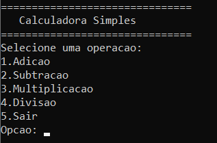
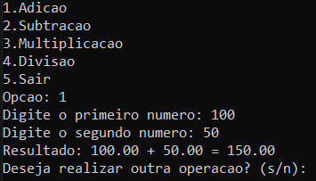
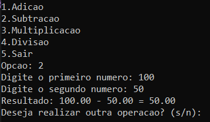

# Calculator-in-C

## 1.Description:
- A C-based calculator capable of doing the four basic mathematical operations.

## 2.Images:






## System Requirements & Installation:
- The minimal requirements to run the app is a 64 bits Windows. 
- The instalation is made by just un-zipping the pack and then initializing the .exe file to run the app.

## Uses and Commands:
- To use the calculator all the customer should do is to choose a number between 1 and 5 in which 1 refers to the sum function, 2 refers to the subtraction, 3 refers to multiplication and 4 refers to division, while 5 is used to end the app.
- After choosing a "**function number**" (from 1 to 4) the app will ask the first number the user want to use and after the second one, by typing them, the app will realize the chosen operation, according to the number and give the user the answer found.
- After the and of any operation, the app will ask the customer if he / she wants to realize any other operation. If the answer if no ("n" or "N"), the app will shut down, however, if the given answer is yes ("s" or "S"), the app will come back to the main screen and start again.

## Structure:
    ```
    Calculator  
    │── main.c

    ```
- The project is composed by a single code archive which is written in C language. The archive contains all the base code to the calculator operation.

## License:
- This project is licensed under the MIT License - to learn more about it, please check [LICENSE](LICENSE).